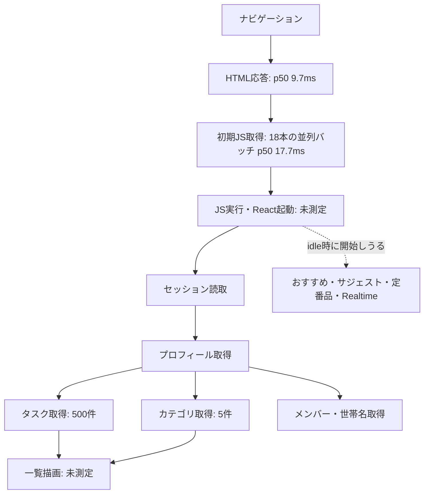
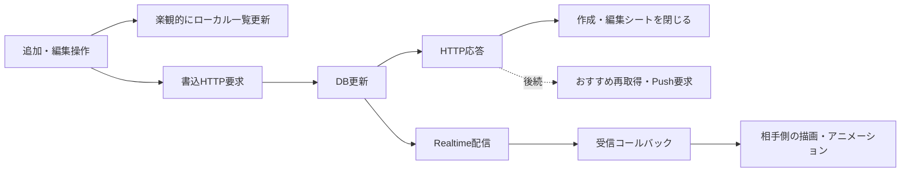

# 通信クリティカルパスの定量計測

測定日: 2026-10-01（JST）。対象ソース: `9ea673d9e0842068e2ab2057f49815fa2f70bd53`。

**ローカル環境の実測であり、本番・スマートフォンの体感時間ではない。** HTTP の要求開始から本文受信・JSON解析までと、コードの依存関係を再現したデータ取得区間を測った。ブラウザ描画時間は含まない。

## 測定条件

- Next.js 16.1.6 の本番ビルド、Node.js v24.19.0、ローカル Supabase / Docker。
- 通信は `127.0.0.1`。インターネットの RTT、DNS、TLS、CDN、モバイル回線の帯域制限は含まない。
- seed のテストユーザーを使用。世帯メンバー1人、カテゴリ5件、定番品0件。
- 合成データ: 未完了100件、完了2,000件。完了は100タイトルを7日周期で20回、最終完了は6日前。メモは各120文字。
- 初期一覧クエリには500件（未完了100件＋直近30日以内の完了400件）が該当。サジェスト500件、おすすめ5件。
- 各 HTTP / データ経路は20回、Realtime購読成立は5回。呼出間に100msの間隔を設けた。
- DB バッファやHTTP接続等は繰り返し実行で温まる。「cold-data-path」はアプリのデータキャッシュがない依存関係の再現であり、DB・OS・DNSまで冷たいコールドスタートではない。
- p50 / p95 は昇順の nearest-rank。20回のp95は19番目、5回のp95は最大値。母集団のSLOを確定するには標本数が足りない。
- 測定開始時のローカルDBは migrations 001〜012のみだった。承認を受けて013〜020をローカルだけへ適用し、以下は原則として**020適用後**の結果を使っている。
- JWT署名方式はES256。本番の署名方式・リージョン・サービスバージョンは未確認。
- 合成データとCRUD用の一時タスクは削除済み。別の認証付き読取で計測用タスクの残件数0を確認した。本番DBや既存タスクの内容は変更していない。

集計データ: [network-measurement-2026-10-01.json](network-measurement-2026-10-01.json)。各リクエストの生の時刻・所要時間は測定時のローカル一時ファイル `/tmp/family-network-audit/current-schema.json` に出力し、このリポジトリには集計結果を保存している。再実行時は指定した出力先に生データも生成される。結果にはトークン・パスワード・タスク本文・世帯IDを記録していない。

## 1. 初回起動の依存関係



図は依存関係のモデル。ブラウザではHTML受信中にJS取得が始まる等の重なりがあり、示した中央値を合計して「画面表示時間」としてはいけない。静的JSの17.7msはNodeから18本を並列に取り寄せたバッチの完了時間であり、ブラウザの接続数・優先順位・実行処理を再現していない。

プロフィールが返った後のタスク・カテゴリは並列。クリティカルパスは両者のうち遅い方までになる。メンバー・世帯名はヘッダーの完成には関係するが、タスク一覧を出すために両方の完了を待つ設計ではない。

| データ取得区間 | p50 | p95 | 計測方法 |
|---|---:|---:|---|
| 世帯ID不明: profile → tasks / categories | **15.75ms** | 34.40ms | プロフィール後に4本を並列取得し、tasks / categoriesの遅い方までを測定 |
| 世帯ID既知: tasks / categoriesを先行 | **13.35ms** | 17.57ms | プロフィールを並列で確認。メンバー等はプロフィール後に取得 |

2.40msの差はこの実行条件での観測。実回線では世帯IDキャッシュによって直列のプロフィール通信待ちを避けられるため、差の大きさは回線RTTによって変わる。

Queryの新鮮なキャッシュがある再訪はさらに別で、一覧のために上記API応答を待つ必要はない。HTML・JS・キャッシュ復元・描画は残る。このブラウザ内の再訪時間は今回未測定。

## 2. 各HTTP要求の時間

以下は各要求を順番に測った単体値であり、同時に呼び出したときの値ではない。純粋なSQL時間ではなく、HTTP、ゲートウェイ、認証・RLS、SQL、JSON生成、本文転送、Node側のJSON解析を含む。

| 通信 | p50 | p95 | 取得件数 / 本文サイズ |
|---|---:|---:|---|
| 自分のプロフィール | 4.33ms | 4.83ms | 1件 |
| 初期タスク一覧 | **10.67ms** | 13.90ms | 500件 / **404,938 bytes** |
| カテゴリ | 3.90ms | 5.08ms | 5件 |
| 世帯メンバー | 3.38ms | 3.82ms | 1件 |
| 世帯名 | 3.41ms | 3.85ms | 1件 |
| 定番品 | 3.44ms | 4.72ms | 0件。大量時の性能を示すものではない |
| おすすめRPC | **26.01ms** | 35.45ms | 5件 / 3,279 bytes |
| 入力候補の元データ | 4.71ms | 6.05ms | 500件 / 48,248 bytes |
| Auth `/user` | **55.60ms** | 68.33ms | getUserに対応するHTTP経路 |
| 認証済みホームHTML | 9.73ms | 15.51ms | proxyの認証を含む。すべてHTTP 200 |

本文サイズはNodeが受け取った展開後のバイト数。圧縮を含む実際の回線転送量は測定していない。

一覧取得ではヘッダー受信までの中央値が約6.5ms、本文受信部分が約2.5ms。おすすめは約25.8msがヘッダーまで、本文受信は約0.13msだった（部分値は通常の中央値）。したがって、この条件ではおすすめの時間は大きな本文のダウンロードでは説明できず、応答前の処理が主である。ただしSQLだけの寄与を確定するにはEXPLAIN等が必要。

## 3. 認証は getSession / getClaims / getUser を区別する

| 処理 | p50 | p95 | 意味 |
|---|---:|---:|---|
| SDK getSession | 0.14ms | 0.17ms | 有効なセッションをメモリに設定済みのNodeクライアント。ブラウザのCookie読取とは異なる |
| SDK getClaims | **1.31ms** | 2.27ms | ES256の検証。初回最大13.54msを含み、以後JWKS等が温まった条件 |
| Auth `/user` HTTP | **55.60ms** | 68.33ms | Authサーバーへの往復 |

現在のホームはproxyにgetClaims、ブラウザ側にgetSessionを使う。**55.6msをホーム起動の必須待ち時間へ足すのは誤り。** getUserはPush API等のサーバー経路で使われる。有効期限切れ時のトークン更新、JWKSのコールド取得、本番の署名方式は別途測定が必要。

## 4. タスク操作のクリティカルパス



| 処理 | p50 | p95 | 測定範囲 |
|---|---:|---:|---|
| タスクINSERT | **5.62ms** | 13.34ms | HTTP開始〜返された行の受信・解析 |
| 完了へのUPDATE | **5.03ms** | 7.82ms | 同上 |
| DELETE | 4.40ms | 7.86ms | HTTP開始〜応答完了 |
| INSERT要求開始→Realtime受信 | **11.12ms** | 19.57ms | SDK受信コールバックまで |
| UPDATE要求開始→Realtime受信 | **10.75ms** | 13.70ms | SDK受信コールバックまで |

Realtimeは別のSDK受信接続を使ったが、同一マシン・同一テストユーザーであり、実機の二端末測定ではない。描画時間も含まない。11.12msはINSERT処理時間を含むので、INSERTの5.62msと足し合わせない。

HTTP返却行は配列形式で計測している。アプリの `.single()` と応答形状は厳密には異なるが、同じテーブル・列・認証ユーザー・操作を使ったAPI経路である。

作成・詳細画面は現在HTTP完了を待って閉じるため、この応答時間と実回線の待ちが操作完了の体感に乗る。チェックの見た目は楽観的更新なので、HTTPが直接の待ち条件にはならない。入力画面のアニメーション、タスクの300ms保留、受信後の描画はこの表には含まない。

Pushは相手への通知を実際に送信するため実行していない。おすすめも画面を閉じるためのawait対象ではない。後続の仕事をすべて操作完了のクリティカルパスへ加算しないことが重要。

## 5. Realtime購読・復帰

購読成立は5回でp50 **9.75ms**、最大 **60.29ms**。最初の接続と後続の接続状態が混在するので、これを本番の再接続p95として扱わない。

現在の復帰処理はvisibility / onlineで tasks・categories・staple_items を並列再取得し、RealtimeのSUBSCRIBEDも再取得を発火する。この依存関係はコードで確認したが、ブラウザのスリープ→復帰を自動再現した測定は未実施。各APIの単体値から復帰全体の時間や二重通信の発生率を断定できない。

## 6. DB構成の違いで観測した変化

同じ合成データで、ローカル旧構成（001〜012）と現構成（001〜020）を測った。

| 処理 | 012まで p50 | 020まで p50 |
|---|---:|---:|
| 一覧500件 | 10.33ms | 10.67ms |
| おすすめ | **44.84ms** | **26.01ms** |
| プロフィール | 4.09ms | 4.33ms |

この条件でおすすめの中央値は約42%短縮された。ただし複数migrationをまとめて適用した比較で、実行順・キャッシュ・通常の揺らぎもある。どのmigrationが何msを削ったかを個別に証明したものではない。履歴2,000件のテストでは一覧の索引効果は明確に出ていない。より大きな履歴・実行計画での確認が必要。

## 判断

1. 初期一覧の通信はプロフィール→一覧という直列依存があり、世帯ID既知ならその待ちを避けられる。本番では回線RTTの影響を追加で測るべき。
2. おすすめは現構成でも通常の小さな読取より重い。重要なのは初期表示を待たせるかと、操作・自己Realtimeで何度呼ぶか。まず不要な再集計回数を抑える候補になる。
3. getClaimsはこのES256環境で軽い。Auth `/user`の55.6msを見て、現在のホーム認証が遅いと結論づけない。
4. 一覧500件は本文が約405KB。ローカルでは10.7msでも、実回線の転送とブラウザの解析・描画では問題になりうる。全カラム取得とメモの分離が検討対象。
5. APIの保存は5ms前後でも、入力画面は応答待ちをしている。通信条件が悪くなる前に、操作受付と保存完了を分ける価値がある。

## 未測定部分

| 項目 | 追加で必要なもの |
|---|---|
| 本番のDNS・TCP・TLS・CDN・TTFB | 本番URLと接続可能な測定環境 |
| 本番の認証済みデータ経路 | ログイン済みの測定用アカウント、データ量の把握 |
| ブラウザのJS解析・キャッシュ復元・表示完了 | Performance / Resource Timingとアプリの計測点、実機 |
| DB純粋実行時間 | 同条件の EXPLAIN (ANALYZE, BUFFERS)、サーバー側の区間計測 |
| Pushの各段階と到着 | 計測専用の通知先と送信する範囲 |
| 並び替え件数別の保存・配信 | 20 / 100 / 500件の専用データと受信側計測 |
| 二端末同期、通信断からの復帰、認証期限切れ | 実端末・回線条件・セッション状態を固定した試験 |

本番URLは今回未指定のため、本番への通信は実施していない。本番の速度として公表できる値ではない。

## 再実行

`scripts/measure-network.mjs` はアプリ本体の振る舞いを変更しない。既定は読取のみで、認証情報は環境変数またはローカルの `.env.local` を使う。テストユーザーの既定値はローカルseed限定。

```sh
# 別のターミナルで本番ビルドを起動
npm run build
npm run start -- -H 127.0.0.1 -p 3100

# Supabase は起動済み・migration適用済みを前提とする
node scripts/measure-network.mjs --samples 20 --fixture --local-writes --output /tmp/network-results.json

# 計測用データが残っていないことを確認
node scripts/measure-network.mjs --verify-cleanup
```

`--fixture` / `--local-writes` はループバック接続かつseedのテストユーザーに限定し、生成したUUIDだけをfinallyで削除する。プロセスを強制終了した場合はfinallyが動かないため、残件数確認を必ず行う。

今回は構文チェック・ESLint成功、全HTTP要求成功（200 / 201 / 204）、Realtimeイベントのタイムアウト0、計測用タスク残件数0を確認した。測定終了時点ではDocker / Supabaseを起動したまま、ローカルDBを020まで更新した状態だった。
