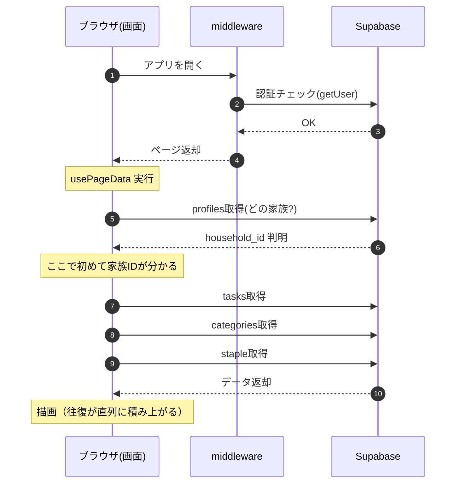
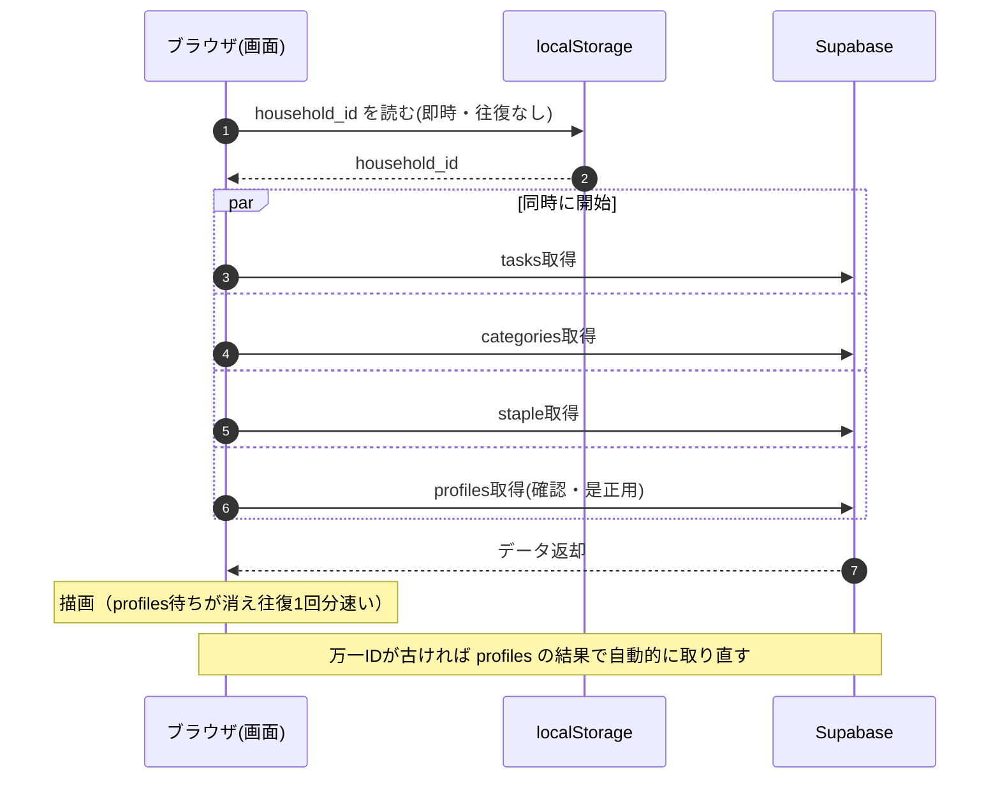

# アプリ起動〜初回描画のフロー

家族タスクアプリを開いてからタスクが表示されるまでの流れ。
「対応前」は profiles 取得を待ってからタスク取得が始まる直列構造、
「対応後」は householdId を localStorage にキャッシュして並列化した構造。

## 対応前：profiles を待ってからタスク取得（直列）



## 対応後：キャッシュ済みIDで即並列取得



## ポイント

- 変わったのは「タスク取得の開始タイミング」。対応前は profiles の応答を待ってから、
  対応後はキャッシュした household_id を使って profiles と同時にスタートする。
- 初回（キャッシュ無し）は対応前と同じ流れ。2回目以降の起動が速くなる。
- ログアウト・世帯切り替え時はキャッシュを消すため、別の家族の情報が混ざらない。

## 関連ファイル

- `src/lib/household-cache.ts` — localStorage への id/名前キャッシュ（get/set/clear）
- `src/hooks/use-page-data.ts` — キャッシュ反映・更新・無効化
- `src/app/page.tsx` — キャッシュ済み householdId をフォールバックに各クエリを早期発火
```
