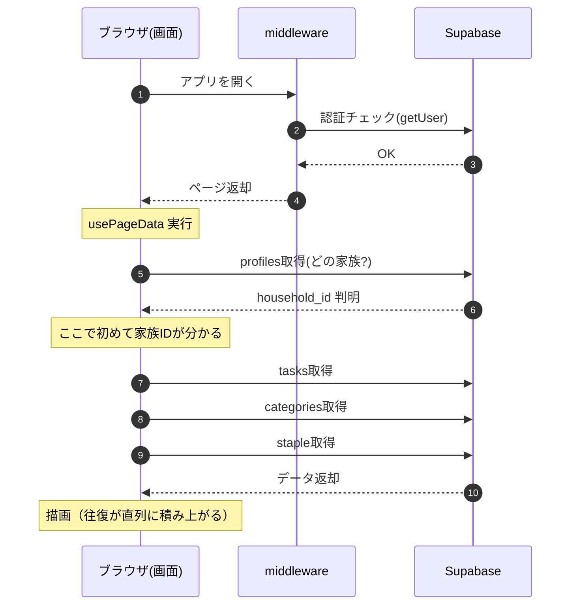
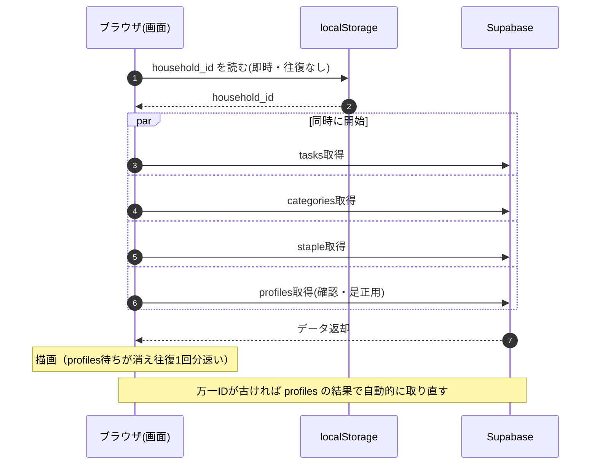

# アプリ起動〜初回描画のフロー

家族タスクアプリを開いてからタスクが表示されるまでの流れ。
「対応前」は profiles 取得を待ってからタスク取得が始まる直列構造、
「対応後」は householdId を localStorage にキャッシュして並列化した構造。

## 対応前：profiles を待ってからタスク取得（直列）

## 対応後：キャッシュ済みIDで即並列取得

## ポイント

- 変わったのは「タスク取得の開始タイミング」。対応前は profiles の応答を待ってから、
  対応後はキャッシュした household_id を使って profiles と同時にスタートする。
- 初回（キャッシュ無し）は対応前と同じ流れ。2回目以降の起動が速くなる。
- ログアウト・世帯切り替え時はキャッシュを消すため、別の家族の情報が混ざらない。

## 関連ファイル

- `src/lib/household-cache.ts` — localStorage への id/名前キャッシュ（get/set/clear）
- `src/hooks/use-page-data.ts` — キャッシュ反映・更新・無効化
- `src/app/page.tsx` — キャッシュ済み householdId をフォールバックに各クエリを早期発火

---

## 追加対応：ドキュメント応答と起動直後の接続競合を削る

上の並列化は「householdId が分かってから」の往復を減らすものだった。
残っていたのは、その手前（HTML が返るまで）と、初回ペイント直後の接続競合。

### 1. proxy の認証チェックをローカル検証にする

`/` は静的プリレンダされていて CDN から即返せるのに、`src/proxy.ts` が全ナビゲーションを
拾い、`updateSession` の `auth.getUser()` が Supabase Auth へ往復してから HTML を返していた。
この往復はそのまま TTFB ＝ PWA 起動直後の白画面の長さになる。

`auth.getClaims()` に置き換えると、JWT の署名検証を WebCrypto でローカルに行い、
JWKS はキャッシュされるため往復が消える。`getSession()` と違って署名を検証するので、
認証判定に使ってよい。

> **前提（未実施だと効果が出ない）**
> ローカル検証が効くのは **プロジェクトの JWT 署名キーが非対称（ECC/RSA）の場合だけ**。
> 対称鍵（レガシーの JWT secret）のままだと `getClaims()` は `getUser()` と同じく
> Auth サーバへ往復する。挙動は変わらない（安全側に倒れる）が速くもならないので、
> Supabase ダッシュボードの Auth → Signing Keys で非対称キーへ移行すること。

### 2. Supabase への preconnect

初期クエリはハイドレーション後に初めて発火するため、そこから DNS + TLS ハンドシェイクが
始まっていた。`src/app/layout.tsx` で `<link rel="preconnect">` を出し、HTML パース時点で
接続を張る（CORS フェッチなので `crossOrigin` 必須）。

### 3. 起動直後に要らないものをアイドルへ逃がす

初回描画までの帯域と接続は tasks / categories に使い切りたい。共通ゲート
`src/hooks/use-idle-ready.ts`（`useIdleReady`）で以下を初回ペイント後まで遅らせる：

| 対象 | 理由 |
|---|---|
| `useStapleItems` の取得 | 定番品シートを開くまで描画に使わない |
| `useRealtimeTasks` / `useRealtimeStapleItems` の購読 | WebSocket ハンドシェイクが初期クエリと競合する |
| `useTaskRecommendations` / `useTitleSuggestions` | 既存のアイドル待ちを共通フックへ寄せただけ（挙動不変） |

Realtime を遅らせると「初期取得のスナップショットと購読開始のあいだ」のイベントを
取りこぼす窓がわずかに広がる。この窓は同時に開始しても元々存在し（取得結果は購読前の状態）、
アイドルは初回ペイント直後に来るため実害は小さい。取りこぼしは `refetchOnWindowFocus` で回収される。

### 残っている改善余地（未対応）

効果順。上 2 つは実装コストが大きいので独立して扱う。

1. **Service Worker のアプリシェルキャッシュ** — `public/sw.js` の fetch リスナは現状 no-op。
   `_next/static/*` を cache-first、ナビゲーションを stale-while-revalidate にすれば
   起動時のネットワーク待ちがほぼ消える。ただし proxy の未認証リダイレクトをバイパスするため、
   キャッシュするシェルは認証情報を含まない骨組みに限る必要がある。
2. **起動時クエリの bootstrap RPC 化** — profiles / households / tasks / categories を
   単一の SECURITY DEFINER 関数にまとめ、往復と RLS 評価を 1 回にする。
3. **キャッシュがあるときはスケルトンを出さない** — 永続キャッシュを持っているのに
   初回ペイントは必ずスケルトン。前回のタスク件数・タブ構成を保存して
   「前回の形」のスケルトンにするだけでも体感が変わる。
4. **`tasks` の `select("*")` 見直し** — memo / url は詳細を開くまで不要。
5. **初期バンドル削減** — `TaskList` を `next/dynamic` 化すると dnd-kit + framer-motion が
   初期チャンクから外れる。
